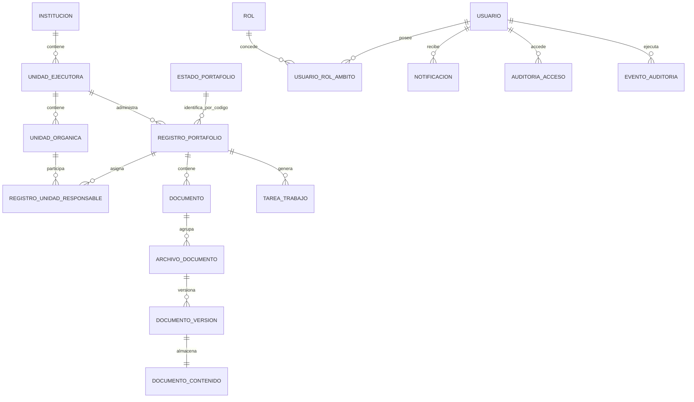

# Modelo de datos final

`ESTADO_PORTAFOLIO` contiene el código natural inmutable, denominación, orden de presentación, actividad y aplicabilidad del estado. `REGISTRO_PORTAFOLIO.ESTADO` conserva el código y tiene una FK por código natural hacia ese catálogo; los cambios de denominación no modifican registros históricos. El esquema JPA actual contiene 21 tablas.

Las restricciones entre ámbitos, la unicidad del proyecto derivado y las transiciones confirmadas se validan en servicios transaccionales y constraints generados por JPA. La metadata del catálogo no crea ni amplía transiciones.
