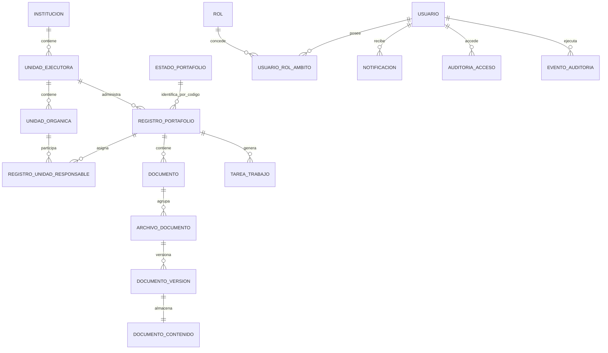

# Modelo de datos final

La cadena organizacional funcional es `INSTITUCION` -> `UNIDAD_EJECUTORA` -> `UNIDAD_ORGANICA`. La administración de UE y UO se mantiene separada de los catálogos de portafolio. `UNIDAD_EJECUTORA` conserva `ORDEN_PRESENTACION`, `FECHA_REGISTRO` y `FECHA_ACTIVACION`; el orden solo controla la presentación y no representa jerarquía. La institución de una UE y la UE de una UO se heredan del contexto administrativo y no son referencias editables.

La escritura administrativa requiere `ADMINISTRADOR_PIIP` con ámbito institucional activo y vigente. La administración no elimina físicamente registros y usa el versionado existente para ediciones y cambios de estado. Los códigos se generan por ámbito: `UE-<consecutivo>` por institución y `UO-<consecutivo>` por UE.

`UNIDAD_ORGANICA.SIGLA` sigue siendo el atributo de sigla de la UO. Para nuevas UO es obligatoria y no vacía; las UO activas con sigla no vacía son las únicas que el catálogo de iniciativas y proyectos ofrece. `ID_UNIDAD_PADRE` permanece como relación técnica histórica pendiente: no se interpreta como jerarquía UO ni participa en los nuevos contratos administrativos.

Los eventos administrativos de `EVENTO_AUDITORIA` incluyen referencias estructuradas de entidad y ámbito para distinguir UE y UO, incluso cuando un código de UO se repite en distintas UE. La consulta de auditoría nunca debe devolver eventos fuera del ámbito autorizado.

`ESTADO_PORTAFOLIO` contiene el código natural inmutable, denominación, orden de presentación, actividad y aplicabilidad del estado. `REGISTRO_PORTAFOLIO.ESTADO` conserva el código y tiene una FK por código natural hacia ese catálogo; los cambios de denominación no modifican registros históricos. El esquema JPA actual contiene 21 tablas.

Las restricciones entre ámbitos, la unicidad del proyecto derivado y las transiciones confirmadas se validan en servicios transaccionales y constraints generados por JPA. La metadata del catálogo no crea ni amplía transiciones.
