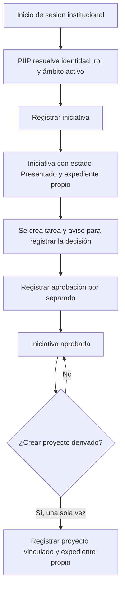

# Guía funcional de PIIP

## Orientación para agentes

El repositorio es la autoridad para el código, las especificaciones, las pruebas y la configuración de PIIP. Graphify es un índice estructural derivado: sirve para orientarse, pero sus resultados se deben contrastar con las fuentes canónicas. El RoviDev Vault conserva continuidad y decisiones aprobadas; no sustituye al repositorio ni define reglas funcionales por sí solo.

## Alcance y lectura de esta guía

PIIP organiza el registro y el seguimiento de iniciativas y proyectos, sus expedientes documentales, tareas, avisos y evidencia de auditoría. Está pensada para responsables de proceso, analistas funcionales, usuarios clave, integrantes nuevos y agentes que necesiten comprender el recorrido antes de intervenir.

Esta es una guía basada en evidencia estática del repositorio. Describe los flujos, validaciones y mensajes que están representados en la interfaz, contratos y servicios. No acredita que una operación se haya ejecutado correctamente en un ambiente institucional ni sustituye una validación con Oracle, Keycloak, usuarios y documentos reales.

## Identidad institucional, rol y ámbito

El ingreso comienza con la autenticación institucional en Keycloak. Después, PIIP resuelve la identidad local y sus asignaciones activas y vigentes. Una identidad autenticada que no tenga una asignación local aplicable no obtiene capacidades funcionales.

Una asignación reúne tres elementos que se evalúan juntos:

- **Rol:** capacidad funcional, por ejemplo `Administrador PIIP` o `Consulta externa`.
- **Institución:** límite organizacional al que pertenece la asignación.
- **Unidad Ejecutora (UE):** alcance más específico de la asignación; cuando la asignación es institucional, cubre las UE de esa institución.

No se debe confundir la UE con las **unidades de organización responsables** que se registran en una iniciativa o proyecto: estas últimas son uno de los campos del portafolio y no constituyen el ámbito de autorización.

El contexto activo de la UE determina qué acciones se ofrecen. Un usuario puede tener `Consulta externa` en una UE y `Administrador PIIP` en otra; el rol privilegiado no se traslada ni se combina con la cobertura de la otra UE. Sobre la misma UE, `Administrador PIIP` prevalece como rol efectivo frente a `Consulta externa`.

## Inicio: tablero de trabajo pendiente

La ruta **Inicio** presenta el tablero de trabajo de la persona usuaria. La información descrita a continuación proviene de evidencia estática: orienta sobre el funcionamiento representado, pero no acredita por sí sola su ejecución operativa.

### Estados del portafolio y acciones pendientes

**Cómo funciona.** El indicador **Acciones pendientes** cuenta las tareas `WorkTask` con estado `PENDING` asignadas a la persona actual dentro de su ámbito de `Administrador PIIP`. Un pendiente pertenece a una tarea; no es el estado de la iniciativa ni del proyecto. En cambio, `Presentado`, `Iniciativa aprobada` y `Proyecto en ejecución` son estados del portafolio. Así, un registro puede conservar su estado y, a la vez, tener una tarea pendiente asociada.

En el flujo confirmado por las fuentes estáticas, al registrar una iniciativa se crea `REGISTER_DECISION`. Al aprobarla, esta tarea se completa y surge `CREATE_DERIVED_PROJECT`. Al crear el proyecto derivado, se completa la segunda tarea. Este recorrido no cambia la distinción entre una tarea pendiente y el estado del registro.

**Limitación funcional identificada.** El tablero no enlaza visiblemente la tarea pendiente con la acción concreta, el registro relacionado ni su etapa.

**Mejora propuesta.** Mostrar para cada pendiente la acción requerida, el código o nombre del registro, la etapa y la fecha límite. Esta es una propuesta de mejora, no un comportamiento actual confirmado.

### Alertas

**Cómo funciona.** Las alertas son el cálculo de tareas abiertas de administradores cuya fecha de vencimiento está próxima o ya venció. Sirven para llamar la atención sobre trabajo que requiere seguimiento; no son estados del portafolio ni notificaciones.

**Limitación funcional identificada.** Una alerta sin contexto no permite saber rápidamente qué hacer ni sobre qué iniciativa o proyecto actuar.

**Mejora propuesta.** Mostrar la acción requerida, el registro, la etapa, la fecha límite y un acceso directo. Esta es una propuesta de mejora, no un comportamiento actual confirmado.

### Notificaciones

**Cómo funciona.** Las notificaciones son avisos persistentes para la persona usuaria sobre eventos. Informan el tipo, el mensaje, la fecha y si están leídas o no leídas. Marcarlas como leídas no completa ni elimina una tarea: el aviso permanece, pero deja de contar como no leído.

En el flujo representado por la evidencia estática, crear una iniciativa genera la tarea `REGISTER_DECISION` y un aviso. Aprobarla completa esa tarea, crea `CREATE_DERIVED_PROJECT` y genera otro aviso. Crear el proyecto derivado completa esa segunda tarea; la revisión estática no halló un aviso adicional para este último paso.

**Limitación funcional identificada.** El aviso por sí mismo no orienta suficientemente sobre la acción, el registro o la etapa a la que se refiere.

**Mejora propuesta.** Incorporar un vínculo directo a la tarea o al registro, la identificación del registro, la etapa, la prioridad y la fecha cuando corresponda. Esta es una propuesta de mejora, no un comportamiento actual confirmado.

## Recorrido principal: de iniciativa a proyecto

### 1. Registrar una iniciativa

Desde el registro de iniciativa, un `Administrador PIIP` de la UE activa completa los datos operativos y adjunta la ficha inicial antes de la revisión final. El sistema genera el código y registra la iniciativa con:

- tipo de registro: **Iniciativa**;
- código de origen: **NA**;
- estado inicial: **Presentado**.

Los datos se organizan alrededor de los 23 campos canónicos: identificación, fechas y responsables, contenido, estado/producto y posiciones documentales. Los seis catálogos controlados incluyen tipo de registro, tipo de solución, fuente u origen, estado, tipo de producto final aprobado y componente digital. `NA` (por ejemplo, ausencia de iniciativa predecesora) y `No aplica` (situación documental o valor de catálogo) no significan lo mismo.

Al registrar la iniciativa se crea su expediente documental y una tarea pendiente para registrar la decisión. También se genera un aviso para la persona asignada y evidencia de auditoría del registro y de la tarea.

Guardar un borrador en la interfaz no es un estado oficial del portafolio; es una ayuda local de la pantalla. La iniciativa oficial aparece cuando se confirma el registro.

### 2. Revisar el expediente, la tarea y la decisión

La iniciativa tiene un expediente propio. La vista de detalle separa la disponibilidad documental de la decisión: muestra los documentos de evaluación y decisión, pero señala que en la versión estática revisada no bloquean automáticamente la aprobación. Por eso, que un documento aparezca pendiente no prueba por sí solo que la iniciativa no pueda aprobarse.

La tarea creada al registrar la iniciativa se puede consultar, completar o reasignar dentro del ámbito autorizado. Los avisos se conservan por destinatario y pueden marcarse como leídos. Estos mecanismos hacen visible trabajo pendiente; no introducen estados nuevos del portafolio.

La aprobación es una acción separada: un `Administrador PIIP` del ámbito de la iniciativa confirma la decisión, con observación opcional para auditoría. Mientras no exista proyecto vinculado, el detalle de la iniciativa también ofrece las decisiones `No Admisible` e `Iniciativa archivada` según la matriz vigente. La aprobación conserva la ruta y operación existentes:

`Presentado` → `Iniciativa aprobada`

Al aprobar, la tarea de decisión pendiente se completa y se crea una nueva tarea que indica que la iniciativa puede originar un proyecto. La aprobación no crea automáticamente el proyecto ni fusiona sus expedientes. `No Admisible` e `Iniciativa archivada` son estados terminales en esta versión.

### 3. Crear un proyecto derivado

Un proyecto derivado se crea explícitamente desde una iniciativa aprobada. El sistema exige que la iniciativa esté en `Iniciativa aprobada`, que el actor sea `Administrador PIIP` en la UE de esa iniciativa y que todavía no exista otro proyecto derivado para el mismo origen. Por lo tanto, la relación es de una iniciativa elegible a un único proyecto derivado.

El nuevo proyecto es un segundo registro vinculado, con código propio y código de origen no editable. La interfaz precarga y permite revisar o editar antes de registrar estos datos comunes de la iniciativa: nombre, tipo de solución, fuente u origen, responsable, unidades de organización responsables, objetivo PEI, actividad POI, descripción y componente digital.

El proyecto empieza con datos propios que no se copian automáticamente: fecha de inicio efectiva, resultados clave y nota. Su estado inicial es `Proyecto en ejecución`. Desde el detalle general, el selector solo ofrece estados propios del proyecto: `Producto aprobado`, `Producto no aprobado`, `Suspendido` y `Cancelado`; `Suspendido` y `Producto no aprobado` pueden volver a `Proyecto en ejecución` o cancelarse, y `Producto aprobado` puede pasar a `Finalizado`.

La iniciativa conserva su registro y su expediente. El proyecto inicia otro expediente, con posiciones documentales propias pendientes, y ofrece un enlace hacia la iniciativa de origen. Los documentos de evaluación y decisión permanecen en el expediente de la iniciativa; no se duplican al proyecto.

Desde que existe el proyecto vinculado, la iniciativa conserva `Iniciativa aprobada` y sus acciones de cambio de estado quedan bloqueadas. La relación `proyecto derivado` identifica el vínculo entre ambos registros; no es un estado adicional.

### 4. Cambiar estados desde los detalles

Las transiciones se inician y confirman desde el detalle contextual, no desde los listados. La iniciativa y el proyecto usan rutas, requests y opciones separadas para impedir mezclar sus estados. `No Aplicable` queda fuera de los destinos de transición de esta versión.

La observación de la persona usuaria acompaña la operación y la auditoría registra registro afectado, estado anterior, estado nuevo, actor, rol, Unidad Ejecutora, fecha, observación y resultado. La versión existente del registro se reutiliza para detectar conflictos; no se crea un segundo versionado.

Al pasar un proyecto a `Finalizado`, `closingDate` se establece con la fecha local de `America/Lima`. Las demás transiciones no crean, borran ni reemplazan esa fecha. Los documentos pendientes se muestran como información y no bloquean las transiciones de esta primera versión.

### 4. Incorporar un proyecto preexistente

Un proyecto preexistente ingresa directamente al portafolio, sin iniciativa predecesora y con código de origen `NA`. No reemplaza el recorrido de evaluación de una iniciativa nueva. La propia interfaz advierte que la evidencia mínima y la autoridad que validan esa incorporación están pendientes de confirmación funcional; esa advertencia debe conservarse como **NEEDS CLARIFICATION** si se detallan reglas adicionales.

## Gestión documental

Cada iniciativa o proyecto mantiene un expediente separado con posiciones para:

1. Ficha de Iniciativa de Innovación Pública.
2. Informe de opinión técnica de evaluación de iniciativa.
3. Documento formal de decisión de aprobación.
4. Documento formal de aprobación de producto final.
5. Documentación de la gestión del proyecto.
6. Informe final de cierre.

Cada posición puede tener versiones. El repositorio controla los formatos PDF, DOCX y XLSX mediante tipo MIME, además de tamaño configurado y checksum. Un `Administrador PIIP` del ámbito del registro puede cargar, marcar una posición como `No aplica` y publicar o retirar una versión para consulta externa. Una persona con `Consulta externa` solo puede descargar versiones publicadas para su ámbito.

### Inconsistencias y límites documentales visibles

Las fuentes crean posiciones para todos los tipos documentales en cada registro, pero el proyecto derivado declara que inicia su expediente propio sin copiar documentos de origen. Para proyectos preexistentes, la interfaz permite marcar como `No Aplica` ciertos documentos y aclara que no se exige retrospectivamente la ficha de iniciativa. Además, la propia vista documental indica que la obligatoriedad de documentos posteriores debe validarse con usuarios y que sus conteos no declaran obligatoriedad por transición.

En consecuencia, no debe inferirse que una posición pendiente impida una aprobación, un proyecto derivado o un cierre. Tampoco debe inventarse una matriz definitiva de documentos obligatorios por etapa: ese criterio requiere confirmación funcional.

## Tareas, notificaciones y auditoría

PIIP conserva tareas pendientes asociadas a registros, con responsable, prioridad, plazo y alerta. Las tareas pueden completarse o reasignarse a otro administrador del mismo ámbito. Los avisos notifican, entre otros hechos, la creación de tareas y la publicación de documentos; cada destinatario puede marcarlos como leídos.

La auditoría funcional conserva eventos como registro de iniciativa, aprobación, registro de proyecto derivado o preexistente, carga/publicación de documentos y operaciones sobre tareas y asignaciones. La bandeja de auditoría está restringida a `Administrador PIIP`. La auditoría de acceso y la funcional no guardan tokens, cuerpos HTTP ni contenido documental.

## Administración de usuarios

La Administración de usuarios administra autorización local de PIIP, no cuentas institucionales. Sirve para que un `Administrador PIIP` consulte y gestione asignaciones de rol y ámbito dentro de las instituciones donde ya posee una asignación vigente de administrador.

### Qué significa el alcance administrativo

Para las operaciones comunes del portafolio, la autorización se evalúa con el rol y la UE real del registro. La Administración de usuarios es una capacidad distinta: al abrirla desde una UE donde el usuario tiene `Administrador PIIP`, puede ver y administrar asignaciones de todas las UE de la misma institución administrable. La UE activa habilita el ingreso; no convierte una asignación administrativa en privilegio operativo sobre otra UE.

Ejemplo: una persona con `Consulta externa` en UE-001 y `Administrador PIIP` en UE-002 puede entrar a Administración desde UE-002 y gestionar asignaciones de UE-001 si ambas pertenecen a la misma institución. Sin embargo, no puede usar el administrador de UE-002 para crear, aprobar, cargar documentos o completar tareas de UE-001. Si cambia a una UE donde solo tiene `Consulta externa`, la pantalla administrativa se cierra y limpia su contenido.

### Crear y editar una asignación

Una asignación identifica a una persona local, un rol, una institución y, opcionalmente, una UE. Elegir “Toda la institución” deja la UE sin especificar y cubre las UE de esa institución para el rol concedido. La interfaz debe advertir y pedir confirmación expresa antes de conceder ese alcance, incluso en una autoasignación.

El administrador puede crear una primera asignación para una persona que ya se autenticó al menos una vez en PIIP y por ello tiene un usuario local. No consulta ni crea usuarios en el directorio Keycloak. La combinación vigente exacta de persona, rol, institución y ámbito no puede duplicarse; el backend además protege la operación ante concurrencia.

Editar modifica la misma asignación: conserva su identidad y permite cambiar rol, institución o UE dentro de la cobertura institucional administrable. La actualización exige una versión esperada para evitar que un cambio desactualizado sobrescriba otro y deja evidencia de los valores antes y después.

### Suspender y reactivar

Retirar una asignación es una suspensión reversible, no una eliminación de la evidencia. Una asignación suspendida puede reactivarse si no genera duplicidad. El sistema protege que no se suspenda ni se cambie la última asignación de `Administrador PIIP` que mantiene la cobertura requerida de un ámbito.

### Límites frente a Keycloak

PIIP no crea cuentas institucionales, no cambia contraseñas, no habilita ni inhabilita cuentas de Keycloak y no sustituye el procedimiento institucional de identidad. Keycloak autentica; PIIP decide las capacidades funcionales a partir de las asignaciones locales activas y vigentes de rol, institución y UE.

## Límites de evidencia

Esta guía no afirma resultados de ejecución. No se ejecutaron aquí compilaciones, pruebas, servidores, contenedores ni integraciones con Oracle o Keycloak. Por ello, la presencia de una pantalla, endpoint, validación o texto no equivale a una validación operativa.

La constitución 1.1.0 y la feature 009 ratifican, además del flujo base `Presentado` → `Iniciativa aprobada`, las matrices contextuales de iniciativa y proyecto descritas en esta guía. La evidencia presentada es estática y no acredita ejecución institucional; las reglas futuras sobre documentos que podrían bloquear transiciones permanecen **NEEDS CLARIFICATION** y no bloquean esta primera versión.

## Fuentes canónicas consultadas

- `docs/architecture/piip-fields.md` para los campos y catálogos canónicos.
- `apps/backend/.../portfolio/application/PortfolioService.java` y `PortfolioController.java` para registro, aprobación y proyectos.
- `apps/backend/.../documents/application/DocumentService.java` y `DocumentType.java` para expediente, versiones, publicación y formatos.
- `apps/backend/.../work/api/WorkController.java` y los componentes de iniciativa, proyecto y documentos para tareas, avisos y representación de interfaz.
- `specs/008-administrar-usuarios/spec.md`, su contrato y `UserAdministrationService.java` para roles, ámbitos, administración y restricciones.
