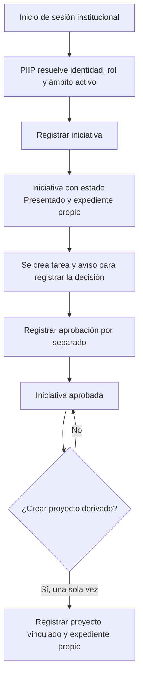

# Guía funcional de PIIP

## Orientación para agentes

El repositorio es la autoridad para el código, las especificaciones, las pruebas y la configuración de PIIP. Graphify es un índice estructural derivado: sirve para orientarse, pero sus resultados se deben contrastar con las fuentes canónicas.

## Alcance y lectura de esta guía

PIIP organiza el registro y el seguimiento de iniciativas y proyectos, sus expedientes documentales, tareas, avisos y evidencia de auditoría. Está pensada para responsables de proceso, analistas funcionales, usuarios clave, integrantes nuevos y agentes que necesiten comprender el recorrido antes de intervenir.

Esta es una guía basada en evidencia estática del repositorio. Describe los flujos, validaciones y mensajes que están representados en la interfaz, contratos y servicios. No acredita que una operación se haya ejecutado correctamente en un ambiente institucional ni sustituye una validación con Oracle, Keycloak, usuarios y documentos reales.

## Identidad institucional, rol y ámbito

El ingreso comienza con la autenticación institucional en Keycloak. Después, PIIP resuelve la identidad local y sus asignaciones activas y vigentes. Una identidad autenticada que no tenga una asignación local aplicable no obtiene capacidades funcionales.

Una asignación reúne tres elementos que se evalúan juntos:

- **Rol:** capacidad funcional, por ejemplo `Administrador PIIP` o `Consulta externa`.
- **Institución:** límite organizacional al que pertenece la asignación.
- **Unidad Ejecutora (UE):** alcance más específico de la asignación; cuando la asignación es institucional, cubre las UE de esa institución.

No se debe confundir la UE con las **Unidades Orgánicas Involucradas** que se registran en una iniciativa o proyecto: son un campo del portafolio y no constituyen el ámbito de autorización.

## Administración de la organización

La administración organizacional tiene dos experiencias independientes: **Unidades Ejecutoras** y **Unidades Orgánicas**. Solo `ADMINISTRADOR_PIIP` con ámbito institucional activo y vigente puede escribir en ellas. El backend vuelve a comprobar el rol y el ámbito en cada operación; ocultar una acción en la interfaz no concede autorización.

### Unidades Ejecutoras

El administrador selecciona una institución autorizada. Si solo tiene una, esta se preselecciona; si tiene varias, debe elegir una antes de consultar o modificar sus UE. La institución aparece como contexto heredado no editable. El alta solicita nombre y, opcionalmente, orden de presentación. Si no se informa el orden, el sistema asigna el mayor orden de esa institución más uno, o `0` cuando no existe otra UE. El código `UE-<consecutivo>` lo genera el backend y no se modifica después.

El orden solo organiza la presentación del listado: se ordena ascendentemente y se desempata por nombre e identificador técnico. No representa una relación jerárquica. La fecha de registro se asigna al alta y la fecha de activación coincide con ella en una UE nueva activa. Desactivar conserva la fecha de activación; reactivar la actualiza al instante de reactivación. La operación es reversible y no elimina físicamente la UE.

### Unidades Orgánicas

Desde una UE se navega a una ruta separada para sus UO. La UE se muestra como contexto heredado no editable y la URL conserva su identificador. El alta solicita nombre, `SIGLA` no vacía y un estado inicial booleano explícito. El código `UO-<consecutivo>` lo genera el backend por UE y no se puede cambiar.

La sigla de UO es el campo `acronym` de la entidad y la columna `UNIDAD_ORGANICA.SIGLA`; la ingresa el administrador autorizado. Una UO activa debe conservar una sigla no vacía y solo las UO activas con sigla aparecen como opciones nuevas en iniciativas y proyectos. Desactivar y reactivar son acciones separadas, versionadas y reversibles. La administración de UO no muestra, envía ni interpreta `ID_UNIDAD_PADRE`, `parent` o `parentId` como jerarquía interna.

Los listados administrativos distinguen activas e inactivas. La auditoría conserva actor, entidad, ámbito, acción, fecha y cambios funcionales seguros. Una consulta sin UE explícita se limita a las UE autorizadas del actor y nunca devuelve un conjunto global.

El contexto activo de la UE determina qué acciones se ofrecen. Un usuario puede tener `Consulta externa` en una UE y `Administrador PIIP` en otra; el rol privilegiado no se traslada ni se combina con la cobertura de la otra UE. Sobre la misma UE, `Administrador PIIP` prevalece como rol efectivo frente a `Consulta externa`.

## Inicio: portafolio de la Unidad Ejecutora activa

La ruta **Inicio** muestra el portafolio consultable de la Unidad Ejecutora activa. El encabezado identifica la UE y declara que los datos corresponden únicamente a esa unidad y al alcance autorizado. Las tareas, prioridades, vencimientos, alertas y métricas operativas no forman parte de este resumen; el contrato legado `/dashboard` se conserva para compatibilidad técnica, pero no es la fuente visual de Inicio.

### Consultar el portafolio

Al abrir Inicio, la pantalla solicita una página global de iniciativas y proyectos con la UE activa. Cada fila muestra código, nombre, tipo, estado actual, Unidad Ejecutora y **Ver detalle**. La acción de detalle deriva de manera real del tipo: una iniciativa abre su módulo de iniciativas y un proyecto abre su módulo de proyectos.

La consulta permite buscar por código o nombre y filtrar por `Todos`, `Iniciativa`, `Proyecto` y estados canónicos activos del catálogo central. Cada página presenta hasta cinco registros. El filtro conserva el código técnico aunque cambie la denominación; cuando se combinan iniciativas y proyectos, la secuencia es única y se ordena por fecha de actualización descendente; un desempate técnico por identificador mantiene estable la paginación.

Los indicadores y la distribución por estado proceden del mismo conjunto filtrado que el listado. Solo se muestran estados con conteo positivo y la suma de sus conteos coincide con el total filtrado. Si se cambia el tipo y el estado seleccionado deja de ser válido, el filtro vuelve a **Estado: Todos** y la página se reinicia.

### Vacío, sin resultados y error

- Si la UE activa no tiene registros, Inicio muestra el estado vacío del portafolio.
- Si existen registros en la UE, pero los filtros no encuentran coincidencias, muestra **Sin resultados** y permite limpiar filtros.
- Si falla una consulta, muestra un error recuperable con **Reintentar**; el error no se presenta como ausencia de datos.

### Mis notificaciones

El bloque **Mis notificaciones** consulta únicamente los avisos del usuario autenticado y muestra tipo, mensaje, fecha y estado de lectura. El resumen compacto presenta las tres notificaciones más recientes. Las pestañas **Todas** y **No leídas** filtran la misma lista; **Ver todas** expande dentro del bloque la lista completa de la pestaña activa.

Renderizar, abrir la campana, cambiar de pestaña o expandir la lista no cambia ninguna lectura. Cada aviso no leído tiene su propio botón **Marcar como leída**; la operación vigente `PUT /notifications/{id}/read` cambia solo ese aviso y actualiza el contador numérico de la campana. No se crean enlaces a iniciativas o proyectos porque el contrato de notificaciones no entrega una referencia contextual confiable.

La campana superior lleva a Inicio y enfoca este bloque desde cualquier pantalla autenticada. No abre un panel separado ni marca automáticamente el último aviso.

**Evidencia y límite de validación.** Esta sección describe el comportamiento implementado en los artefactos de la feature 010. La ejecución de pruebas, build, generación OpenAPI y validaciones de integración permanece pendiente de autorización explícita.

## Recorrido principal: de iniciativa a proyecto

### 1. Registrar una iniciativa

Desde el registro de iniciativa, un `Administrador PIIP` de la UE activa completa los datos operativos y adjunta la ficha inicial antes de la revisión final. El sistema genera el código y registra la iniciativa con:

- tipo de registro: **Iniciativa**;
- código de origen: **NA**;
- estado inicial: **Presentado**.

Los datos se organizan alrededor de los 23 campos canónicos: identificación, fechas y responsables, contenido, estado/producto y posiciones documentales. Los seis catálogos controlados incluyen tipo de registro, tipo de solución, fuente u origen, estado, tipo de producto final aprobado y componente digital. `NA` (por ejemplo, ausencia de iniciativa predecesora) y `No aplica` (situación documental o valor de catálogo) no significan lo mismo.

Antes de habilitar el registro, PIIP obtiene del backend las opciones vigentes de Tipo de solución, Fuente u origen, Objetivo PEI, Actividad POI, Tipo documental y estados del portafolio. Tipo de registro también procede del backend como catálogo técnico; la opción **Todos** pertenece únicamente a los filtros de la interfaz. El formulario resuelve el nombre del estado inicial por su código y bloquea la confirmación si el catálogo no está disponible, el estado no está activo o no aplica al tipo de registro. Objetivo PEI y Actividad POI son selecciones independientes y opcionales: elegir una no filtra, exige ni modifica la otra.

La persona selecciona las opciones por su nombre, pero PIIP conserva y envía sus identidades. Las **Unidades Orgánicas Involucradas** se consultan después de conocer la Unidad Ejecutora y solo incluyen opciones activas de esa UE con sigla registrada. El registro exige una lista ordenada de una o más unidades, sin máximo funcional ni repeticiones: cada fila muestra Nro, Descripción y Abreviatura de solo lectura; se agregan al final, se puede retirar cualquier fila salvo la última y el Nro se renumera automáticamente en la secuencia 1..N. Si la carga continúa, queda vacía o falla, la pantalla lo diferencia y no reemplaza la respuesta con listas locales. Un campo requerido sin opciones válidas bloquea la confirmación y ofrece reintentar la consulta.

Al registrar la iniciativa se crea su expediente documental y una tarea pendiente para registrar la decisión. También se genera un aviso para la persona asignada y evidencia de auditoría del registro y de la tarea.

Guardar un borrador en la interfaz no es un estado oficial del portafolio; es una ayuda local de la pantalla. La iniciativa oficial aparece cuando se confirma el registro.

### 2. Revisar el expediente, la tarea y la decisión

La iniciativa tiene un expediente propio. La vista de detalle separa la disponibilidad documental de la decisión: muestra los documentos de evaluación y decisión, pero señala que en la versión estática revisada no bloquean automáticamente la aprobación. Por eso, que un documento aparezca pendiente no prueba por sí solo que la iniciativa no pueda aprobarse.

La tarea creada al registrar la iniciativa se puede consultar, completar o reasignar dentro del ámbito autorizado. Los avisos se conservan por destinatario y pueden marcarse como leídos. Estos mecanismos hacen visible trabajo pendiente; no introducen estados nuevos del portafolio.

La aprobación es una acción separada: un `Administrador PIIP` del ámbito de la iniciativa confirma la decisión, con observación opcional para auditoría. Mientras no exista proyecto vinculado, el detalle de la iniciativa también ofrece las decisiones `No Admisible` e `Iniciativa archivada` según la matriz vigente. La aprobación conserva la ruta y operación existentes:

`Presentado` → `Iniciativa aprobada`

Al aprobar, la tarea de decisión pendiente se completa y se crea una nueva tarea que indica que la iniciativa puede originar un proyecto. La aprobación no crea automáticamente el proyecto ni fusiona sus expedientes. `No Admisible` e `Iniciativa archivada` son estados terminales en esta versión.

### 3. Crear un proyecto derivado

Un proyecto derivado se crea explícitamente desde una iniciativa aprobada. El sistema exige que la iniciativa esté en `Iniciativa aprobada`, que el actor sea `Administrador PIIP` en la UE de esa iniciativa y que todavía no exista otro proyecto derivado para el mismo origen. Por lo tanto, la relación es de una iniciativa elegible a un único proyecto derivado.

El nuevo proyecto es un segundo registro vinculado, con código propio y código de origen no editable. La interfaz precarga y permite revisar o editar antes de registrar estos datos comunes de la iniciativa: nombre, tipo de solución, fuente u origen, responsable, Unidades Orgánicas Involucradas, objetivo PEI, actividad POI, descripción y componente digital. La lista completa de unidades de la iniciativa de origen se conserva en el mismo orden como valor inicial editable; la persona puede agregar o retirar filas antes de confirmar.

Si una referencia heredada dejó de estar activa, permanece visible como contexto histórico, pero no sirve como selección para la nueva escritura. La persona debe reemplazarla por una opción vigente antes de confirmar el proyecto. PIIP no sustituye automáticamente esa elección ni vuelve a ofrecer el elemento inactivo entre las opciones.

El proyecto empieza con datos propios que no se copian automáticamente: fecha de inicio efectiva, resultados clave y nota. Su estado inicial es `Proyecto en ejecución`. Desde el detalle general, el selector solo ofrece estados propios del proyecto: `Producto aprobado`, `Producto no aprobado`, `Suspendido` y `Cancelado`; `Suspendido` y `Producto no aprobado` pueden volver a `Proyecto en ejecución` o cancelarse, y `Producto aprobado` puede pasar a `Finalizado`.

La iniciativa conserva su registro y su expediente. El proyecto inicia otro expediente, con posiciones documentales propias pendientes, y ofrece un enlace hacia la iniciativa de origen. Los documentos de evaluación y decisión permanecen en el expediente de la iniciativa; no se duplican al proyecto.

Desde que existe el proyecto vinculado, la iniciativa conserva `Iniciativa aprobada` y sus acciones de cambio de estado quedan bloqueadas. La relación `proyecto derivado` identifica el vínculo entre ambos registros; no es un estado adicional.

### 3.1 Editar un registro existente

La acción **Editar** solo se muestra defensivamente a un `Administrador PIIP` que cubre la UE real del registro. La autorización efectiva se vuelve a comprobar en el backend; abrir directamente la ruta no evita las reglas. Una iniciativa se puede editar únicamente en `Presentado` y sin proyecto derivado. Un proyecto se puede editar únicamente en `Proyecto en ejecución`, tanto si es derivado como preexistente.

El formulario carga una copia fresca, conserva la identidad, el código, el origen, el estado, la relación y la UE, y envía únicamente propiedades modificadas junto con la `version` esperada. La ausencia de una propiedad conserva su valor; PEI, POI y nota pueden enviarse explícitamente como nulos. Las Unidades Orgánicas Involucradas se sustituyen como una lista completa y ordenada de una o más referencias, sin máximo funcional ni repeticiones; todas las nuevas referencias deben estar activas, pertenecer a la UE del registro y tener sigla registrada. La validación es atómica: una fila inválida no modifica asociaciones previas. El contrato conserva el nombre técnico `responsibleUnits`; los errores por fila identifican la posición afectada. Un valor histórico inactivo permanece visible como contexto y no se reutiliza para escribir; editar otros campos sin modificar la lista conserva íntegramente las asociaciones históricas.

Un cambio efectivo devuelve la representación completa con nueva fecha de modificación y versión superior, y genera un único evento funcional con actor, UE, versiones y diff estable sin cuerpo HTTP. Un envío sin cambios produce `422`; una referencia o lista inválida produce `422`; la falta de autorización produce `403`; una ruta inexistente produce `404`; y una versión obsoleta produce `409` sin reintento automático. Ante `409`, la pantalla conserva la copia local y ofrece **Recargar versión vigente**. La navegación o el cierre de la pestaña advierten solo si existen cambios pendientes y no se persisten borradores locales.

### 4. Cambiar estados desde los detalles

Las transiciones se inician y confirman desde el detalle contextual, no desde los listados. La iniciativa y el proyecto usan rutas, requests y opciones separadas para impedir mezclar sus estados. Sus destinos son la intersección de la matriz vigente, la actividad y la aplicabilidad del catálogo; la metadata del catálogo nunca habilita una transición. `No Aplicable` queda fuera de los destinos de transición de esta versión.

La observación de la persona usuaria acompaña la operación y la auditoría registra registro afectado, códigos de estado anterior y nuevo, sus denominaciones vigentes cuando estén disponibles, actor, rol, Unidad Ejecutora, fecha, observación y resultado. Los eventos anteriores que solo contienen texto se preservan como histórico. La versión existente del registro se reutiliza para detectar conflictos; no se crea un segundo versionado.

Al pasar un proyecto a `Finalizado`, `closingDate` se establece con la fecha local de `America/Lima`. Las demás transiciones no crean, borran ni reemplazan esa fecha. Los documentos pendientes se muestran como información y no bloquean las transiciones de esta primera versión.

### 4. Incorporar un proyecto preexistente

Un proyecto preexistente ingresa directamente al portafolio, sin iniciativa predecesora y con código de origen `NA`. No reemplaza el recorrido de evaluación de una iniciativa nueva. La propia interfaz advierte que la evidencia mínima y la autoridad que validan esa incorporación están pendientes de confirmación funcional; esa advertencia debe conservarse como **NEEDS CLARIFICATION** si se detallan reglas adicionales.

## Gestión documental

Cada iniciativa o proyecto mantiene un expediente separado con posiciones para:

1. Ficha de Iniciativa de Innovación Pública.
2. Informe de opinión técnica de evaluación de iniciativa.
3. Documento formal de decisión de aprobación.
4. Documento formal de aprobación de producto final.
5. Documentación de la gestión del proyecto.
6. Informe final de cierre.

Los seis tipos proceden del catálogo documental del backend y están disponibles tanto para iniciativas como para proyectos. Cada posición conserva la identidad del tipo documental; su código estable puede utilizarse para ordenar o agrupar la presentación, pero no sustituye al identificador de las operaciones.

Cada posición puede tener versiones. El repositorio controla los formatos PDF, DOCX y XLSX mediante tipo MIME, además de tamaño configurado y checksum. Un `Administrador PIIP` del ámbito del registro puede cargar, marcar una posición como `No aplica` y publicar o retirar una versión para consulta externa. Una persona con `Consulta externa` solo puede descargar versiones publicadas para su ámbito. Si un tipo documental ya utilizado queda inactivo, la posición histórica continúa visible y conserva sus operaciones vigentes; ese tipo no se ofrece para crear una referencia nueva.

### Inconsistencias y límites documentales visibles

Las fuentes crean posiciones para todos los tipos documentales en cada registro, pero el proyecto derivado declara que inicia su expediente propio sin copiar documentos de origen. Para proyectos preexistentes, la interfaz permite marcar como `No Aplica` ciertos documentos y aclara que no se exige retrospectivamente la ficha de iniciativa. Además, la propia vista documental indica que la obligatoriedad de documentos posteriores debe validarse con usuarios y que sus conteos no declaran obligatoriedad por transición.

En consecuencia, no debe inferirse que una posición pendiente impida una aprobación, un proyecto derivado o un cierre. Tampoco debe inventarse una matriz definitiva de documentos obligatorios por etapa: ese criterio requiere confirmación funcional.

La bandeja de expedientes consulta y muestra únicamente los registros de la Unidad Ejecutora activa. Si esa unidad no tiene expedientes, presenta el estado vacío y no mezcla información de otra Unidad Ejecutora.

## Tareas, notificaciones y auditoría

PIIP conserva tareas pendientes asociadas a registros, con responsable, prioridad, plazo y alerta. Las tareas pueden completarse o reasignarse a otro administrador del mismo ámbito. Los avisos notifican, entre otros hechos, la creación de tareas y la publicación de documentos; cada destinatario puede marcarlos como leídos.

La auditoría funcional conserva eventos como registro de iniciativa, aprobación, registro de proyecto derivado o preexistente, carga/publicación de documentos y operaciones sobre tareas y asignaciones. Las altas de iniciativas y proyectos registran la lista ordenada de Unidades Orgánicas Involucradas; las modificaciones conservan su valor anterior y nuevo. Cada elemento identifica la unidad, Nro, Descripción y Abreviatura. La bandeja de auditoría está restringida a `Administrador PIIP` y aplica el ámbito de la Unidad Ejecutora activa a los eventos y accesos mostrados. La vista de accesos permite consultar, por expediente, fecha, método, ruta normalizada, código HTTP, `Correlation ID` y duración. La auditoría de acceso y la funcional no guardan tokens, cuerpos HTTP ni contenido documental. Las notificaciones siguen siendo personales del usuario autenticado y no se restringen por Unidad Ejecutora.

## Administración de usuarios

La Administración de usuarios administra autorización local de PIIP, no cuentas institucionales. Sirve para que un `Administrador PIIP` consulte y gestione asignaciones de rol y ámbito dentro de las instituciones donde ya posee una asignación vigente de administrador.

### Qué significa el alcance administrativo

Para las operaciones comunes del portafolio, la autorización se evalúa con el rol y la UE real del registro. La Administración de usuarios es una capacidad distinta: al abrirla desde una UE donde el usuario tiene `Administrador PIIP`, puede ver y administrar asignaciones de todas las UE de la misma institución administrable. La UE activa habilita el ingreso; no convierte una asignación administrativa en privilegio operativo sobre otra UE.

Ejemplo: una persona con `Consulta externa` en UE-001 y `Administrador PIIP` en UE-002 puede entrar a Administración desde UE-002 y gestionar asignaciones de UE-001 si ambas pertenecen a la misma institución. Sin embargo, no puede usar el administrador de UE-002 para crear, aprobar, cargar documentos o completar tareas de UE-001. Si cambia a una UE donde solo tiene `Consulta externa`, la pantalla administrativa se cierra y limpia su contenido.

### Crear y editar una asignación

Una asignación identifica a una persona local, un rol, una institución y, opcionalmente, una UE. Elegir “Toda la institución” deja la UE sin especificar y cubre las UE de esa institución para el rol concedido. La interfaz debe advertir y pedir confirmación expresa antes de conceder ese alcance, incluso en una autoasignación.

El administrador puede crear una primera asignación para una persona que ya se autenticó al menos una vez en PIIP y por ello tiene un usuario local. No consulta ni crea usuarios en el directorio Keycloak. La combinación vigente exacta de persona, rol, institución y ámbito no puede duplicarse; el backend además protege la operación ante concurrencia.

Editar modifica la misma asignación: conserva su identidad y permite cambiar rol, institución o UE dentro de la cobertura institucional administrable. La actualización exige una versión esperada para evitar que un cambio desactualizado sobrescriba otro y deja evidencia de los valores antes y después. Tras una mutación propia, la interfaz vuelve a obtener identidad, ámbitos y UEs; si no puede confirmar la UE original, limpia Administración y navega a Inicio.

### Suspender y reactivar

Retirar una asignación es una suspensión reversible, no una eliminación de la evidencia. Una asignación suspendida puede reactivarse si no genera duplicidad y la respuesta devuelve la asignación confirmada. Una persona puede suspender su propia asignación `CONSULTA_EXTERNA` si conserva otro grant administrativo, pero la propia asignación `ADMINISTRADOR_PIIP` permanece visible y no ejecutable. El sistema protege que no se suspenda ni se cambie la última asignación de `Administrador PIIP` que mantiene la cobertura requerida de un ámbito.

Las mutaciones distinguen errores mediante `problemCode` estable (`STALE_VERSION`, `FORBIDDEN_SCOPE`, `ACTIVE_ASSIGNMENT_DUPLICATE`, `SELF_ADMIN_SUSPENSION`, `LAST_ACTIVE_ADMIN`, `INCOMPATIBLE_ASSIGNMENT_STATE`, `INVALID_ACTIVE_REFERENCE`, entre otros). Los accesos rechazados pueden mostrar en Auditoría un `safeReason` nullable; no se persisten tokens, cuerpos HTTP ni el detalle libre del error.

### Límites frente a Keycloak

PIIP no crea cuentas institucionales, no cambia contraseñas, no habilita ni inhabilita cuentas de Keycloak y no sustituye el procedimiento institucional de identidad. Keycloak autentica; PIIP decide las capacidades funcionales a partir de las asignaciones locales activas y vigentes de rol, institución y UE.

## Límites de evidencia

Esta guía no afirma resultados de ejecución. No se ejecutaron aquí compilaciones, pruebas, servidores, contenedores ni integraciones con Oracle o Keycloak. Por ello, la presencia de una pantalla, endpoint, validación o texto no equivale a una validación operativa.

La constitución 1.1.0 y la feature 009 ratifican, además del flujo base `Presentado` → `Iniciativa aprobada`, las matrices contextuales de iniciativa y proyecto descritas en esta guía. La evidencia presentada es estática y no acredita ejecución institucional; las reglas futuras sobre documentos que podrían bloquear transiciones permanecen **NEEDS CLARIFICATION** y no bloquean esta primera versión.

## Fuentes canónicas consultadas

- `docs/architecture/piip-fields.md` para los campos y catálogos canónicos.
- `apps/backend/.../portfolio/application/PortfolioService.java` y `PortfolioController.java` para registro, aprobación y proyectos.
- `apps/backend/.../documents/application/DocumentService.java` y el modelo persistente de Tipo documental para expediente, versiones, publicación y formatos.
- `specs/011-centralizar-catalogos-piip/` para identidades de catálogo, disponibilidad histórica y límites del reset de pruebas.
- `apps/backend/.../work/api/WorkController.java` y los componentes de iniciativa, proyecto y documentos para tareas, avisos y representación de interfaz.
- `specs/008-administrar-usuarios/spec.md`, su contrato y `UserAdministrationService.java` para roles, ámbitos, administración y restricciones.
